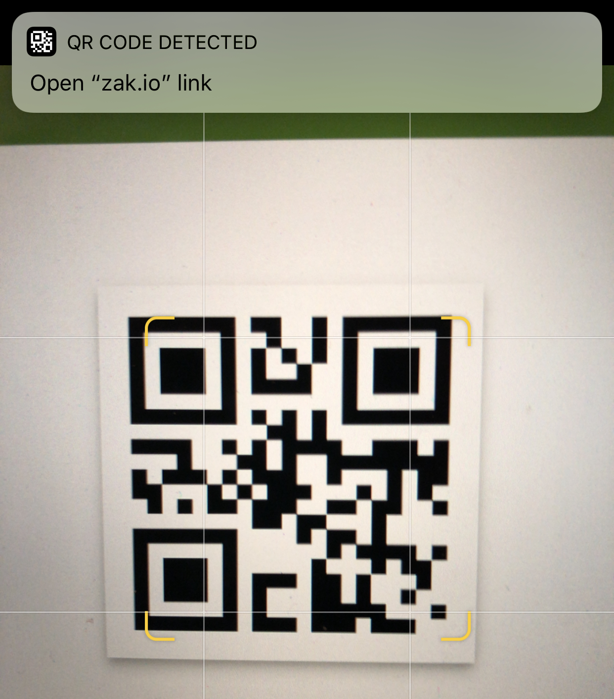

iPads are great devices for quickly accessing information. There's no startup or login time - ideal for class activities, especially with younger kids. But getting 20+ iPads to the same place quickly can seem daunting. Luckily, iPads running recent versions of iOS have built-in QR code readers.

Quick Response (QR) codes are 2 dimensional bar codes that can be scanned by smart phones. They can contain text, phone numbers, and links. They have lots of applications, but one great use is to quickly get students’ iPads to websites without typing. In this post, I’ll show you how to set up QR codes and use them with iOS devices.

## Creating QR Codes

1. Visit [this website](https://www.the-qrcode-generator.com/)
2. Click "URL" and type or paste the URL of the website you want to share

   
3. Your QR code will display on the right side of the screen. You can display this webpage directly or click the "save" button to download an image to print, project, or otherwise share with your students

## Navigating Via QR Code

This will work with any iOS device, including both iPhones and iPads.

1. Open the built-in camera app 
2. Point the camera at the code (don't take a picture!)
3. Once the phone recognizes the code, it will display a banner that the top of the screen. Tap the banner to go to the website.

   

To test this on your own device, scan the code at the top of this post.
