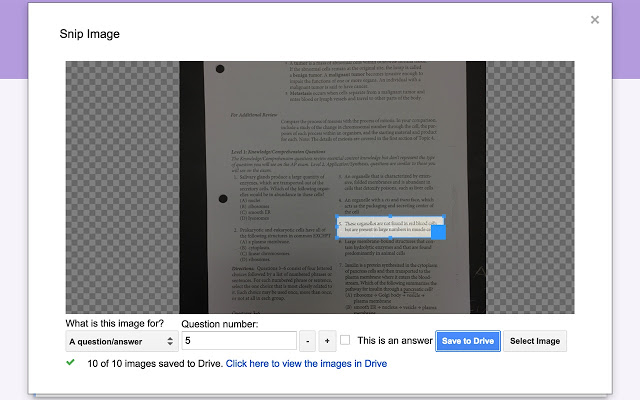

Google Forms is an awesome tool for creating online assignments. It's easy to set up and share. The responses are stored in one convenient place. It's a great option for digitizing previously paper-based assignments and quizzes.

However, print materials that have images or diagrams can pose a problem for Google Forms. Maybe students need to refer to a diagram of a cell to answer a question or choose the graph that best represents a given equation. If these graphics exist on a piece of paper or even a digital version of an assignment, how can you get them into Google Forms in an efficient way?

## Snip add-on

My Snip add-on helps you quickly "snip" one or more sections of an image to use in Google Forms. The process is simple:

1. Choose an image of an existing assignment from your Google Drive (or upload a new one)
2. Use the snipping tool to save one or more images/diagrams from your assignment into your Google Drive

3. Add the images to the questions/response options on your Google Form

PDFs aren't supported, but there are [online tools](https://pdf2jpg.net/) that you can use to convert PDFs to images to use with Snip.

Below is a full tutorial for using Snip. [Click here to open the tutorial in a new window](https://www.iorad.com/player/1569646/Using-Snip-in-Google-Forms#trysteps-1){: target="_blank"}.
    
  

    <i style="font-style: italic; font-weight: bold; color: #CCCCCC; font-size: 18px;">23 STEPS</i>
  

  

    <b style="font-weight: normal; width: 40px; height: 40px; display: inline-block; border: 2px solid #CCCCCC; color: #CCCCCC; border-radius: 100%; text-align: center; box-sizing: border-box; padding-left: 1px; margin-right: 24px; position: absolute;">
      1
    </b>
    From your Google Form, open the&nbsp;<b style="font-weight: bold; color: #FF2B6B;">Add-ons&nbsp;</b>menu (<b style="font-weight: bold; color: #FF2B6B;">puzzle piece</b>)
  

  

    
  

  

    <b style="font-weight: normal; width: 40px; height: 40px; display: inline-block; border: 2px solid #CCCCCC; color: #CCCCCC; border-radius: 100%; text-align: center; box-sizing: border-box; padding-left: 1px; margin-right: 24px; position: absolute;">
      2
    </b>
    Click <b style="font-weight: bold; color: #FF2B6B;">Snip</b>
  

  

    
  

  

    <b style="font-weight: normal; width: 40px; height: 40px; display: inline-block; border: 2px solid #CCCCCC; color: #CCCCCC; border-radius: 100%; text-align: center; box-sizing: border-box; padding-left: 1px; margin-right: 24px; position: absolute;">
      3
    </b>
    Click <b style="font-weight: bold; color: #FF2B6B;">Snip Images</b>
  

  

    
  

  

    <b style="font-weight: normal; width: 40px; height: 40px; display: inline-block; border: 2px solid #CCCCCC; color: #CCCCCC; border-radius: 100%; text-align: center; box-sizing: border-box; padding-left: 1px; margin-right: 24px; position: absolute;">
      4
    </b>
    Click <b style="font-weight: bold; color: #FF2B6B;">Select Image</b>
  

  

    
  

  

    <b style="font-weight: normal; width: 40px; height: 40px; display: inline-block; border: 2px solid #CCCCCC; color: #CCCCCC; border-radius: 100%; text-align: center; box-sizing: border-box; padding-left: 1px; margin-right: 24px; position: absolute;">
      5
    </b>
    Select an image of your worksheet from your Google Drive (or upload a new one)
  

  

    
  

  

    <b style="font-weight: normal; width: 40px; height: 40px; display: inline-block; border: 2px solid #CCCCCC; color: #CCCCCC; border-radius: 100%; text-align: center; box-sizing: border-box; padding-left: 1px; margin-right: 24px; position: absolute;">
      6
    </b>
    Click <b style="font-weight: bold; color: #FF2B6B;">Select</b>
  

  

    
  

  

    <b style="font-weight: normal; width: 40px; height: 40px; display: inline-block; border: 2px solid #CCCCCC; color: #CCCCCC; border-radius: 100%; text-align: center; box-sizing: border-box; padding-left: 1px; margin-right: 24px; position: absolute;">
      7
    </b>
    Move and resize the box to cover a portion of the worksheet you'd like to "snip" into its own image (e.g. a diagram to display with the question)
  

  

    
  

  

    <b style="font-weight: normal; width: 40px; height: 40px; display: inline-block; border: 2px solid #CCCCCC; color: #CCCCCC; border-radius: 100%; text-align: center; box-sizing: border-box; padding-left: 1px; margin-right: 24px; position: absolute;">
      8
    </b>
    Choose whether this "snip" is informational or tied to a specific question. This is used to name the "snipped" image in a useful way when it is saved to your Drive.
  

  

    
  

  

    <b style="font-weight: normal; width: 40px; height: 40px; display: inline-block; border: 2px solid #CCCCCC; color: #CCCCCC; border-radius: 100%; text-align: center; box-sizing: border-box; padding-left: 1px; margin-right: 24px; position: absolute;">
      9
    </b>
    If it's a question or answer, specify the question number by typing or using the +/- buttons
  

  

    
  

  

    <b style="font-weight: normal; width: 40px; height: 40px; display: inline-block; border: 2px solid #CCCCCC; color: #CCCCCC; border-radius: 100%; text-align: center; box-sizing: border-box; padding-left: 1px; margin-right: 24px; position: absolute;">
      10
    </b>
    If it's an answer option, check "<b style="font-weight: bold; color: #FF2B6B;">This is an answer</b>"
  

  

    
  

  

    <b style="font-weight: normal; width: 40px; height: 40px; display: inline-block; border: 2px solid #CCCCCC; color: #CCCCCC; border-radius: 100%; text-align: center; box-sizing: border-box; padding-left: 1px; margin-right: 24px; position: absolute;">
      11
    </b>
    Click <b style="font-weight: bold; color: #FF2B6B;">Save to Drive</b>
  

  

    
  

  

    <b style="font-weight: normal; width: 40px; height: 40px; display: inline-block; border: 2px solid #CCCCCC; color: #CCCCCC; border-radius: 100%; text-align: center; box-sizing: border-box; padding-left: 1px; margin-right: 24px; position: absolute;">
      12
    </b>
    Move the box and repeat as many times as you need to in order to "snip" all of your images
  

  

    
  

  

    <b style="font-weight: normal; width: 40px; height: 40px; display: inline-block; border: 2px solid #CCCCCC; color: #CCCCCC; border-radius: 100%; text-align: center; box-sizing: border-box; padding-left: 1px; margin-right: 24px; position: absolute;">
      13
    </b>
    Make sure all of your images save to your Drive
  

  

    
  

  

    <b style="font-weight: normal; width: 40px; height: 40px; display: inline-block; border: 2px solid #CCCCCC; color: #CCCCCC; border-radius: 100%; text-align: center; box-sizing: border-box; padding-left: 1px; margin-right: 24px; position: absolute;">
      14
    </b>
    Click <b style="font-weight: bold; color: #FF2B6B;">Close</b>
  

  

    
  

  

    <b style="font-weight: normal; width: 40px; height: 40px; display: inline-block; border: 2px solid #CCCCCC; color: #CCCCCC; border-radius: 100%; text-align: center; box-sizing: border-box; padding-left: 1px; margin-right: 24px; position: absolute;">
      15
    </b>
    Click <b style="font-weight: bold; color: #FF2B6B;">Add question&nbsp;</b>(or select an existing question)
  

  

    
  

  

    <b style="font-weight: normal; width: 40px; height: 40px; display: inline-block; border: 2px solid #CCCCCC; color: #CCCCCC; border-radius: 100%; text-align: center; box-sizing: border-box; padding-left: 1px; margin-right: 24px; position: absolute;">
      16
    </b>
    Click <b style="font-weight: bold; color: #FF2B6B;">Add inline image&nbsp;</b> For multiple choice questions, you can also add images to choice options.
  

  

    
  

  

    <b style="font-weight: normal; width: 40px; height: 40px; display: inline-block; border: 2px solid #CCCCCC; color: #CCCCCC; border-radius: 100%; text-align: center; box-sizing: border-box; padding-left: 1px; margin-right: 24px; position: absolute;">
      17
    </b>
    Click <b style="font-weight: bold; color: #FF2B6B;">Google Drive</b>
  

  

    
  

  

    <b style="font-weight: normal; width: 40px; height: 40px; display: inline-block; border: 2px solid #CCCCCC; color: #CCCCCC; border-radius: 100%; text-align: center; box-sizing: border-box; padding-left: 1px; margin-right: 24px; position: absolute;">
      18
    </b>
    Navigate to the Snip folder in your drive
  

  

    
  

  

    <b style="font-weight: normal; width: 40px; height: 40px; display: inline-block; border: 2px solid #CCCCCC; color: #CCCCCC; border-radius: 100%; text-align: center; box-sizing: border-box; padding-left: 1px; margin-right: 24px; position: absolute;">
      19
    </b>
    Navigate to the folder that corresponds with the current form.  Depending on your form, it may list the title of the form or the date the form was created.
  

  

    
  

  

    <b style="font-weight: normal; width: 40px; height: 40px; display: inline-block; border: 2px solid #CCCCCC; color: #CCCCCC; border-radius: 100%; text-align: center; box-sizing: border-box; padding-left: 1px; margin-right: 24px; position: absolute;">
      20
    </b>
    Click the "snipped" image you'd like to use
  

  

    
  

  

    <b style="font-weight: normal; width: 40px; height: 40px; display: inline-block; border: 2px solid #CCCCCC; color: #CCCCCC; border-radius: 100%; text-align: center; box-sizing: border-box; padding-left: 1px; margin-right: 24px; position: absolute;">
      21
    </b>
    Click <b style="font-weight: bold; color: #FF2B6B;">Select</b>
  

  

    
  

  

    <b style="font-weight: normal; width: 40px; height: 40px; display: inline-block; border: 2px solid #CCCCCC; color: #CCCCCC; border-radius: 100%; text-align: center; box-sizing: border-box; padding-left: 1px; margin-right: 24px; position: absolute;">
      22
    </b>
    If necessary, you can resize the image
  

  

    
  

  

    <b style="font-weight: normal; width: 40px; height: 40px; display: inline-block; border: 2px solid #CCCCCC; color: #CCCCCC; border-radius: 100%; text-align: center; box-sizing: border-box; padding-left: 1px; margin-right: 24px; position: absolute;">
      22b
    </b>
    Drop
  

  

    
  

  

    <b style="font-weight: normal; width: 40px; height: 40px; display: inline-block; border: 2px solid #CCCCCC; color: #CCCCCC; border-radius: 100%; text-align: center; box-sizing: border-box; padding-left: 1px; margin-right: 24px; position: absolute;">
      23
    </b>
    Add any additional information to your question
  

  

    
  

<h3 style="display: none;font-size: 18px; padding-bottom: 20px; color: #000000">
  Here's an interactive tutorial for the visual learners
</h3>

  <a href="https://www.iorad.com/player/1569646/Using-Snip-in-Google-Forms">https://www.iorad.com/player/1569646/Using-Snip-in-Google-Forms</a>

<iframe src="https://www.iorad.com/player/1569646/Using-Snip-in-Google-Forms?src=iframe&oembed=1"
        width="100%" height="500px"
        style="width: 100%; height: 500px"
        frameborder="0" webkitallowfullscreen="webkitallowfullscreen"
        mozallowfullscreen="mozallowfullscreen" allowfullscreen="allowfullscreen"></iframe>

  
  
 Happy Snipping! If you use this add-on and have any feedback or thoughts, [I'd love to hear them]()!